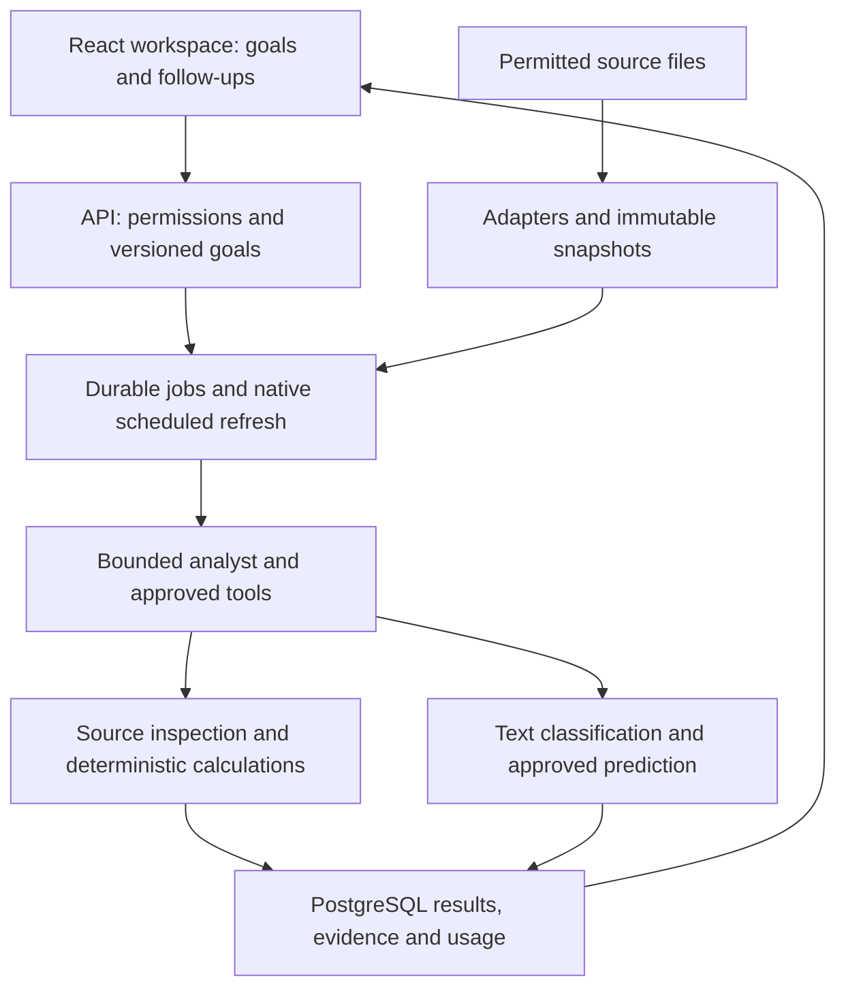

# Current BackIntel System Architecture

Checked October 6, 2026 against the consolidated local source. This describes implemented boundaries, not production or complete live acceptance. Historical October 1 architecture remains in the preserved Git branches.

BackIntel lets an analyst save a question about one permitted dataset, inspect evidence-linked findings, ask follow-ups, and refresh the answer after source changes. Each goal belongs to one domain. Cross-domain joins and arbitrary generated investigations are not implemented by this workspace.

## Current analysis path

| Surface | Responsibility | Source |
| --- | --- | --- |
| Current workspace | Sources, goals, conversation, results, evidence, model approval and history | `apps/web` |
| API and access | Role/source permissions, expiry, goal/run endpoints, credential redaction | `runtime/analysis_api.py`, `analysis_auth.py`, `analysis_store.py` |
| Sources | File fingerprints, bounded cohorts, label availability, entity/time splits, domain caveats | `runtime/analysis_data.py`, `config/analysis.json` |
| Execution | Durable admission, duplicate reuse, attempt recovery, source refresh, last-good answer retention | `runtime/analysis_service.py`, `runtime/jobs.py` |
| Framework entry points | Goal resolution, bounded analysis and refresh graphs | `aegra.analysis.json`, `runtime/analysis_graphs.py` |
| Analyst | Approved hosted model using source inspection, summaries, predictions, text interpretation, snapshot comparison and prior findings; structured evidence-linked output | `runtime/analysis_agent.py` |
| Predictors | Constant/simple-text baselines, CatBoost and TabICLv2 comparisons; Decide text features; held-out metrics and hashed artifacts | `runtime/analysis_models.py`, `runtime/real_models.py` |
| Storage | PostgreSQL owns application state/evidence and durable jobs; Redis supports worker dispatch | `compose.analysis.yml`, migrations `0010` and `0011` |

The current Compose profile runs one worker, two CPU threads and a 5 GiB worker limit. These limits do not establish concurrent-user capacity. Paid request reservations, measured-charge settlement, and uncertain-charge blocking remain separate from unmeasured local compute cost. Human approval is required to promote a predictor.

## Other retained surfaces

`frontend` and `reflex_demo` are earlier decision-review demonstrations. The recorded business demo opens preserved results without new inference. They do not replace `apps/web`.

The earlier capability engine, Jev interpretation, source contracts, prediction lifecycle, attention rules, reports, and local Docker sandbox remain available. Original Olist processing is historical code/evidence; the removed OlistV2 dataset is not restored or part of this campaign. See [repository map](repository-map.md) for those modules.

## Evidence boundaries

The October 2 working-tree benchmark records selected real model comparisons and checked analyst answers for Commerce, Support and Maintenance. Support tickets and engine trajectories remain synthetic data. The recovered source adds broader offline workflow checks and a partial real Telco comparison. Credit files are unavailable. No complete real five-domain campaign or combined cross-domain investigation is established.

The [benchmark campaign](../roadmap/BenchmarkCampaign.txt) freezes the consolidated candidate and separates workflow fixtures, actual local predictors and actual hosted analyst execution. Historical results do not qualify a new commit. [Acceptance history](analysis-acceptance.md) and [October 4 campaign](analysis-validation-campaign.md) retain their original scope and dates.

## Local operation and development

Use the [runbook](analysis-workspace-runbook.md). Canonical source is `/Users/hudson/Documents/GitHub/BackIntel` on `codex/backintel-consolidated`. Datasets remain outside Git under `~/Library/Application Support/BackIntel/Datasets`; existing weights and model evidence remain under ignored `artifacts/Models`. The existing local Docker project is `backintel-local-resume`; its name preserves the existing volumes and does not identify the canonical source folder.

Local development credentials and loopback services are not production identity or deployment. External notifications, live bank connectors and automated lending decisions remain outside this implementation.
