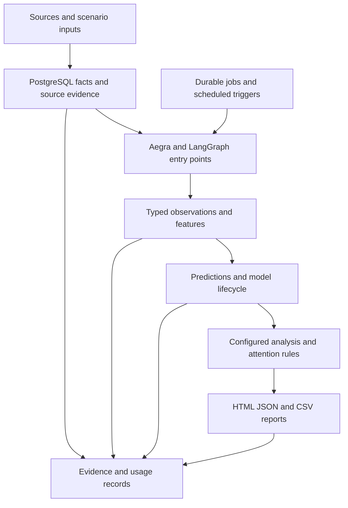

# Current BackIntel System Architecture

**Checked:** October 1, 2026.  
**Source baseline:** `c4565a00f4e073d09f626fbdda134feffed5cb14`, before this documentation update.  
**Scope:** Repository implementation, saved result boundaries, and limited local runtime observation. This is an architecture walkthrough, not a new validation or security audit.

BackIntel currently automates a predefined sequence: collect records, retain their origin, interpret selected text, predict outcomes, identify items needing attention, and produce reports. It has real integrations and development scenarios. It is not yet a user-directed analyst that plans investigations from arbitrary standing questions.

Less repeated preparation and more current analysis are intended benefits. Time saved, predictive value, and whole-job replacement remain unproven. Reviews and issue triage are examples, not the universal product schema.

The [Goal Driven Analysis Enhancement](goal-driven-analysis.md) records the broader direction and proposed React workspace. The [repository map](repository-map.md) remains the detailed file index.

## Architecture at a Glance

Available stages do not establish that all stages completed together with real data/models. Offline simulation, generic development, staged real-model execution, and the preserved Olist example have different evidence boundaries.

## Services and Responsibilities

| Component | Practical role | Source |
| --- | --- | --- |
| Python application | Validates requests and coordinates sources, models, jobs, and reporting. | [Runtime](../../runtime), [commands](../../scripts) |
| Aegra and LangGraph | Serve registered graphs and support background execution/scheduling. | [Registration](../../aegra.json), [capability graph](../../runtime/capability_graph.py) |
| PostgreSQL | Stores facts, sources, observations, evidence, jobs, models, and usage. | [Migrations](../../migrations), [evidence](../../runtime/evidence.py), [ledger](../../runtime/ledger.py) |
| Redis | Supports configured worker/broker machinery; business records remain in PostgreSQL. | [Runtime Compose](../../compose.runtime.yml), [isolated Compose](../../compose.capabilities.yml) |
| Source contracts | Validate mapped inputs, revisions, duplicates, and time-scoped selection. | [Contracts](../../runtime/contracts.py) |
| Interpretation | Records typed findings, actual model/request, source, and cost; fixtures are separate. | [Jev](../../runtime/jev.py), [real semantics](../../runtime/real_semantics.py), [development observations](../../runtime/observations.py) |
| Prediction | Builds time-scoped features/outcomes, evaluates models, scores records, and handles updates/corrections. | [Prediction](../../runtime/prediction.py), [real models](../../runtime/real_models.py), [configuration](../../config/real_models.json) |
| Jobs and attention | Schedule/claim bounded work, record attempts, reuse accepted results, and maintain attention state. | [Jobs](../../runtime/jobs.py), [pipeline](../../runtime/capability_pipeline.py), [attention](../../runtime/attention.py) |
| Reporting and local review | Audience-scoped reports, sources, corrections, and local review views. | [Artifacts](../../runtime/artifacts.py), [audience server](../../runtime/audience_server.py), [Olist report](../../runtime/report.py) |
| Restricted execution | Local Docker isolation for candidate code, with bounded outputs and review evidence. | [Sandbox](../../runtime/sandbox.py), [generated artifacts](../../runtime/generated_artifacts.py) |

## Registered Graphs

[Graph registration](../../aegra.json) declares:

| Graph | Behavior |
| --- | --- |
| `olist_fixture` | Synthetic partition/delay probe for runtime recovery; not Olist processing. |
| `olist_review_enrichment` | Review interpretation or recorded replay, snapshots, period comparisons, and reports. |
| `capability_simulation` | Runs configured simulation through the application ledger and writes reports. |
| `capability_platform` | Dispatches allowed preparation, interpretation, comparison, follow-up, bootstrap, and cancellation operations through jobs. |

These graphs primarily wrap predefined Python operations. The generic entry point still has support/equipment-specific dispatch constraints. Registration or service health is not evidence that every operation passed acceptance.

## Preserved Olist Flow

Original CSVs are fingerprinted and loaded as reconciled PostgreSQL facts. Review text receives typed Jev measurements or recorded observations. The graph builds versioned signals, compares selected periods, and produces source-linked HTML/JSON.

The default review graph uses recorded replay. The real classifier uses Jev through OpenRouter and retains source, question, actual model/request, and usage identity. This example demonstrated collection, database processing, interpretation, and reporting; it does not establish a completed predictive comparison on those Jev-enriched records.

Sources: [loader](../../scripts/data/load_olist_facts.py), [review graph](../../runtime/review_graph.py), [Jev](../../runtime/jev.py), [signals](../../runtime/signals.py), and [saved recovery/results](../roadmap/poc-recovery-plan.md).

## Generic Development and Real Model Paths

Synthetic support/equipment records exercise admission, corrections, observations, features, predictions, attention, and reports. The current `analyze` function combines interpretation/prediction signals using a configured rule. It does not plan SQL investigations or run an open-ended analysis agent.

Offline simulations/development packages can use simulated observations and predictors. Approved model paths run real CatBoost/TabICLv2. Integrated recovery checks have used real predictors with fixture Jev. The staged real path rejects simulated/incomplete interpretation where real acceptance is required.

[Model configuration](../../config/real_models.json) pins CatBoost and separate TabICLv2 classification/regression checkpoints, CPU settings, and file hashes. TabICLv2 is one tabular foundation model; this is not evidence of Google TabFM or other model integrations.

Sources: [pipeline](../../runtime/capability_pipeline.py), [real stages](../../runtime/real_pipeline.py), [real semantics](../../runtime/real_semantics.py), [prediction](../../runtime/prediction.py), and [README boundaries](../../README.md).

## Tested Dataset Boundaries

| Dataset family | Saved evidence supports | Remaining boundary |
| --- | --- | --- |
| Olist commerce | Fact engineering, reports, and recorded real Jev calls. | No confirmed complete Jev-enriched CatBoost/TabICLv2 comparison. |
| Synthetic support | Workflow/recovery and real predictor classification paths. | Fixture interpretation remains simulated; full real-Jev journey unfinished. |
| Synthetic equipment | Workflow/recovery and real predictor regression paths. | Same interpretation/full-run limits. |
| Historical VS Code issues | Facts-only experiment: 19 training and seven later test cases with real CatBoost/TabICLv2. | No System One features; neither model beat the baseline. |

See [issue prediction results](../research/issue-prediction-results.md), [README evidence](../../README.md), and [PoC recovery](../roadmap/poc-recovery-plan.md). This update did not rerun models or historical checks. Further Kaggle candidates remain researched, not tested.

## Local Runtime Observation

Read-only Docker inspection on October 1 found healthy preserved and isolated capability runtime containers, both attached to the canonical checkout. The preserved service exposes localhost port 2026; the isolated service exposes port 2027 with separate PostgreSQL/Redis services and volumes. A separate capability test database also runs.

The isolated Compose definition bounds workers/model threads, binds application/database access to localhost, and mounts model/report files. It uses `AUTH_TYPE=noop` for local demonstrations. It is not a production multi-user bank permission system.

This confirms running containers and checkout association only, not exact image/source parity, complete journeys, deployment, or predictive quality. No service, database record, volume, or credential changed during this walkthrough.

## Frontend and Artifact Boundary

Current delivery consists of reports, audience-scoped local viewers, review/correction features, and restricted generated layouts. A general React workspace for sources, standing goals, agent conversations, and run history is proposed.

Local sandbox code and recorded checks exist. The broader broker, arbitrary generated applications, and production publication in [Artifact Execution Plane](execution-plane.md) remain proposed or only partly represented. Routine report refresh does not require generating a new application.

## Enhancement Compared with Today

| Today | Proposed enhancement |
| --- | --- |
| Developer-configured scenarios/operations | User-created versioned goals and source permissions. |
| Preset analysis/attention rules | Bounded investigation agent and tools. |
| Scenario-specific interpretation | Interchangeable providers/schemas with attribution and evaluated quality. |
| Reports/local viewers | React sources, goals, evidence, conversation, and history. |
| Recovery checks and limited experiments | Frozen cross-domain engineering, interpretation, prediction, agent-answer, and recovery benchmarks. |

The next useful outcome is one complete saved-goal journey with a refreshed answer and interruption/resume. It builds on existing foundations without claiming the autonomous analyst already exists.

## Continuous analysis candidate

The approved enhancement now has a local implementation under validation. The isolated analysis configuration adds source adapters, saved goals, three workflows, protected application routes, model comparisons, and the React workspace. This candidate is separate from the established report delivery described above. Its full five-domain journey is not yet accepted. See [the workspace runbook](analysis-workspace-runbook.md) for current operation and evidence.
