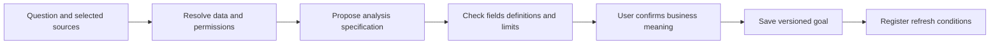
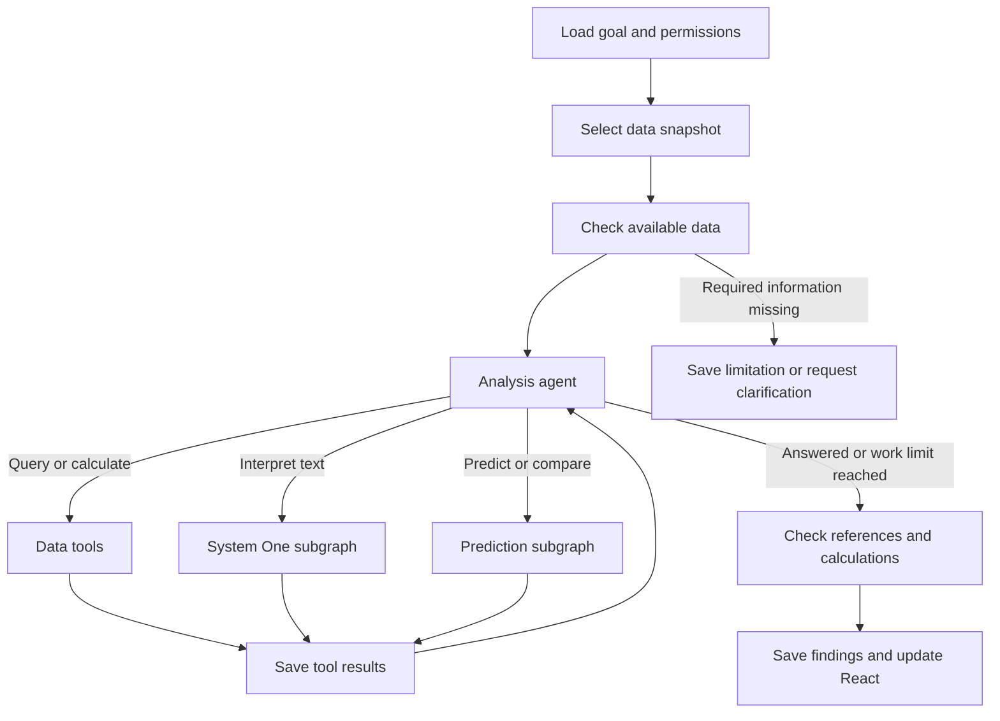

# BackIntel Goal Driven Analysis Enhancement

**Status:** Approved implementation plan; local implementation and validation in progress. Real acceptance remains conditional on dataset access, model execution, browser checks, and exact-candidate evidence.  
**Recorded:** October 1, 2026.

Current implementation evidence and remaining acceptance gaps are recorded in [analysis acceptance](analysis-acceptance.md).
**Purpose:** Let users save analytical goals, select permitted sources, and receive updated, evidence-linked answers as data changes.

BackIntel should support background intelligence across domains. Reviews and software issue triage are examples, not the product boundary. A credit manager, support lead, commerce analyst, or maintenance supervisor should be able to ask a specific question and inspect how the system answered it.

This enhancement adds a goal-driven analysis agent and a proposed React workspace to existing data, prediction, jobs, and reporting foundations. It does not declare the platform complete or change an existing validation result. Implementation, paid inference, external writes, deployment, publication, and merge retain their applicable authorization boundaries.

Read [Current BackIntel System Architecture](current-system.md) for the present implementation and [the repository map](repository-map.md) for file ownership. The existing [roadmap](../roadmap/v0.1.0-development-roadmap.md) describes an issue-review demonstration. This design records the broader enhancement without silently replacing that execution plan.

## User Outcome

As a user responsible for a recurring decision, I want to give BackIntel a question and permitted sources so it can keep an analysis current, explain changes, and prepare a review without making me repeat the investigation after every update.

Observable outcomes:

1. The user receives an answer with inspectable calculations, sources, model estimates, and limitations.
2. Relevant updates refresh the answer while preserving previous findings and definitions.
3. Interrupted work resumes, duplicate arrivals do not duplicate accepted results, and the user can steer or pause the goal.

Saved time, better decisions, and lower cost remain intended benefits until measured. Loan decisions and other consequential business actions are outside the initial analysis authority.

## Credit Manager Example

**Illustrative scenario, not a measured result or implemented capability:**

> Monitor our loan portfolio. Identify groups where repayment risk is increasing, show accounts that deserve review, and explain changes using available evidence. Refresh after each daily data load.

Goal setup resolves the repayment outcome and time horizon, permitted tables and populations, comparison periods, grouping definitions, and notification criteria. The manager confirms the business meaning when creating or materially changing the standing goal. Routine queries within that scope do not require repeated approval.

If a dataset lacks payment history, outcomes, or timestamps, the system reports the limitation or proposes a narrower analysis. It does not invent an outcome or silently replace the question. Static Kaggle snapshots cannot themselves establish live bank monitoring.

A run might compare group-level estimates, inspect changes in applicant composition and missing values, retrieve account predictions, and produce a review queue. Findings distinguish observations, estimates, and possible explanations. Association is not presented as cause; predictions are not presented as observed repayment events.

## Component Responsibilities

Start with one analysis agent inside a durable workflow, supported by specialist subgraphs. Add specialist agents only when a demonstrated task needs different reasoning, context, or ownership. Established calculations and model operations remain tools.

| Component | Responsibility |
| --- | --- |
| React workspace | Goal setup, source selection, progress, findings, review queues, follow-ups, corrections, and run history. |
| Application backend | Authentication, dataset/result permissions, versioned goals, run submission, and presentation contracts. |
| Scheduler and ingestion events | Start affected goals after a successful source update or scheduled check; deduplicate starts. |
| LangGraph workflow | Coordinate steps, checkpoint progress, route bounded investigations, and pause/resume for needed input. |
| Analysis language model | Understand the question, choose permitted tools, interpret results, and explain findings. |
| System One model | Classify or extract useful text; retain typed results, source, uncertainty, and model identity. |
| Data and calculation tools | Execute permitted queries, validate joins, profile data, and calculate reproducible statistics. |
| Prediction tools | Build approved features, apply CatBoost/TabICLv2, and run separately scoped training/evaluation jobs. |
| PostgreSQL and files | Retain sources, goal/run identities, observations, predictions, model metadata, calculations, and reports. |

The approved demonstration uses local GLiNER2.5-Decide for text interpretation and hosted GPT-6.1 Sol for planning and explanation. Real Decide, CatBoost, and TabICLv2 comparisons have run for commerce and support; maintenance has a real CatBoost/TabICLv2 comparison. Jev remains in the legacy workflow and is excluded from this benchmark. GLiDE is a separate Fastino model; no public local deployment path was established in the October 1 research. These measurements cover the selected cohorts, not every tabular foundation model or production operating condition.

## Goal Setup Graph

This graph runs for a new question or material change:

The goal saves its owner/access scope, question, sources, outcome definitions, allowed investigations, requested outputs, refresh/notification rules, and work budget. A follow-up investigation changes the standing goal only when the user chooses to save that change.

## Analysis Run Graph

The agent chooses useful follow-up investigations within the agreed goal, permitted tools, available data, and remaining budget. It stops when the question is answered, information is unavailable, or the work limit is reached. A failed or partial refresh does not replace the last completed result as if it succeeded.

Tools cover table/schema inspection, authorized queries, snapshot comparisons, statistics, bounded text interpretation, approved prediction, and retrieval of prior findings. They return compact results and references; full datasets remain outside model context.

Recurring metrics reuse saved calculations when compatible. New investigations can produce a new plan version. The agent does not redefine metrics every refresh. Training and model promotion are separate from ordinary scoring/reporting. Independent work may run in parallel; predictions wait for their required features and interpretation versions.

## Continuous Execution and Recovery

Continuous analysis consists of finite runs started by source updates, schedules, or user follow-ups. LangGraph is not an endless background loop or a database-change listener. Reuse BackIntel's durable jobs and native scheduling foundations.

Identify equivalent work from goal version, data snapshot, and operation. Keep separate run/attempt and checkpoint identities. Persist tool records and accepted results so a restart reuses completed operations and resumes unfinished work. A checkpoint is not a universal transaction or a guarantee of exactly-once external requests. Record uncertain provider requests rather than blindly repeating them.

The browser may close without stopping jobs. Pausing a goal suppresses future starts; treatment of an active run is explicit. Corrections retain history and invalidate affected results. Revoked access prevents further source access and marks affected results stale or unavailable. Model work has concurrency, time, and resource bounds.

## Saved State

| Record | Contents |
| --- | --- |
| Goal | Owner, question, scope, definitions, tool policy, refresh rules, output contract, and version. |
| Source snapshot | Dataset versions, hashes, original identifiers, event/available-at times, and field definitions. |
| Run | Goal/snapshot references, plan version, current step, completed tools, budget, status, and errors. |
| Observation | Input/source, schema version, actual provider/model, typed answer, uncertainty, and usage. |
| Prediction | Feature/model versions, evaluation/scoring context, output, and source references. |
| Finding | Claim, supporting results, fact/estimate/explanation type, limitations, and comparison period. |
| User review | Comment, correction, acknowledgement, or goal change with actor and time. |

Checkpoint state keeps identifiers and compact context, not large results or credentials. PostgreSQL/files hold durable data. A growing chat transcript is not the authority for metrics, snapshots, or model results.

## Storage and Workspace

Keep one canonical BackIntel checkout. Preserve domain-specific tables rather than flattening every domain into review records. Common goal/run/result records connect them.

| Material | Location |
| --- | --- |
| Adapters, scenario contracts, and tests | Owning repository; proposed `config/benchmarks` and relevant code/tests. |
| Original and prepared datasets | Proposed `/Users/hudson/Library/Application Support/BackIntel/Datasets/`; originals remain unchanged and derived files identify their inputs. |
| Working records and run state | Isolated benchmark PostgreSQL database; preserve Olist data and runtime volumes. |
| Model weights | Existing ignored `artifacts/Models/`, with pinned identities. |
| Durable benchmark outputs | Proposed `/Users/hudson/Library/Application Support/BackIntel/Evidence/Benchmarks/`. |

Large datasets stay outside Git and enter the database in batches. Start with frozen samples on the 16GB Mac, then measure larger runs. Retention/deletion must respect source terms and privacy requirements.

## React Workspace

| Surface | User capability |
| --- | --- |
| Data sources | Select permitted sources; inspect freshness, fields, and quality limitations. |
| Goals | Create/revise questions, definitions, refresh rules, and notification thresholds. |
| Analysis | Inspect findings, tables, charts, periods, and source records. |
| Review queue | Inspect selected cases and record decisions/corrections. |
| Run history | Inspect running, completed, paused, failed, stale, and superseded results. |
| Conversation | Ask bounded follow-ups; explicitly save changes to the standing goal. |

Backend progress events and clarification requests update React. The latest completed result remains visible while a refresh runs. Outputs use a structured schema for summaries, findings, tables, charts, sources, and limitations, rendered through trusted components.

Ordinary analysis does not generate executable frontend code. Generated scripts/custom interfaces remain a separate restricted capability in [Artifact Execution Plane](execution-plane.md). Backend/database enforcement controls access; prompt instructions alone do not. Source text is data, not agent instructions. The local demo's authentication mode is not a production bank access model.

## Cross Domain Benchmarks

Before evaluation, each scenario defines its question, input cutoff, target, source checks, train/calibration/test cases, metrics, and execution budget. Methods share the same held-out cases. Use chronology where available and appropriate fixed/grouped splits otherwise. Prevent future-field and related-entity leakage.

| Domain | Candidate sources and initial tests |
| --- | --- |
| Commerce | [Clothing reviews](https://www.kaggle.com/datasets/nicapotato/womens-ecommerce-clothing-reviews): expressed recommendation and text interpretation. [DataCo](https://www.kaggle.com/datasets/shashwatwork/dataco-smart-supply-chain-for-big-data-analysis): joins and order-time delivery prediction. |
| Support | [Consumer complaints](https://www.kaggle.com/datasets/kirbysasuke/consumer-complaints): narrative interpretation and retrospective response analysis. [Synthetic IT tickets](https://www.kaggle.com/datasets/ahsanneural/synthetic-it-support-tickets): controlled full-pipeline tests. |
| Churn | [Telco](https://www.kaggle.com/datasets/blastchar/telco-customer-churn): small structured benchmark. [KKBox](https://www.kaggle.com/competitions/kkbox-churn-prediction-challenge/data): historical activity and multi-table processing. |
| Credit | [Home Credit](https://www.kaggle.com/competitions/home-credit-default-risk/data): application-time prediction and relational histories. [LendingClub](https://www.kaggle.com/datasets/wordsforthewise/lending-club): loan outcomes, conditional on source terms. |
| Maintenance | [NASA C-MAPSS](https://www.kaggle.com/datasets/behrad3d/nasa-cmaps): simulated engine sequences/remaining life. [AI4I original](https://www.kaggle.com/datasets/stephanmatzka/predictive-maintenance-dataset-ai4i-2020): synthetic failure classification. |

These are October 1 research candidates, not downloaded/tested data. Competition rules apply to Home Credit/KKBox; Telco lists original-author rights; LendingClub's uploader flags source terms despite a CC0 mirror label; AI4I's original Kaggle upload declares a noncommercial license. Complaint publication delays/missing narratives limit submission-time reconstruction. Synthetic data demonstrates controlled behavior, not representative field performance.

With useful text, compare seven routes: a simple baseline; CatBoost and TabICLv2 on original structured features; both predictors with Jev findings; both with Decide findings. Include a simple text baseline when otherwise the interpretation provider would gain information omitted from the comparison. Structured-only sources need not manufacture narratives or use System One. Other tabular foundation models require their own integrations.

| Layer | What to measure |
| --- | --- |
| Data engineering | Joins, missing/duplicate records, rejected inputs, traceability, and processing time. |
| Interpretation | Human-labeled examples, extraction/classification errors, probability reliability, latency, and usage. |
| Prediction | Held-out classification/probability or regression error and baseline comparison. |
| Analysis agent | Known-answer questions, correct calculations, supporting sources, and honest missing-data handling. |
| Background operation | Arrivals, duplicates, late records, corrections, cancellation, restart, and replay equivalence. |
| Resources | End-to-end time, peak memory, actual provider charges, and separately identified local compute estimates/measurements. |

Keep domain metrics separate rather than inventing a platform score. Static-data replay simulates arrivals; it does not prove a live connection. Evidence supports its exact code/model/data candidate. Tests and reports are not shipment or production readiness.

## Delivery Sequence

1. Add versioned goals and backend access controls; expose setup/status in React.
2. Deliver one bounded analyst/tool loop over frozen data with inspectable results.
3. Integrate interpretation/prediction tools; preserve attribution and separate training from scoring.
4. Add update-triggered refresh, recovery, history, corrections, and material-change notifications.
5. Test text-rich support and sensor-based maintenance, then extend the same mechanism to commerce, churn, and credit.

Acceptance covers goal creation, permitted analysis, an inspectable answer, source update, refreshed result, user correction, and interruption/resume. Real-model acceptance uses real interpretation/predictors; fixtures remain explicitly simulated.

Unresolved choices remain here until implementation planning: analysis-model provider, first scenario/target, role/source mapping, outcome/notification thresholds, retention, and run/paid-call budgets. Future roadmap/work items should link this design rather than duplicate it.

## Principal Brief for Implementation Planning

- **Outcome:** Reusable saved-goal analysis journey, followed by cross-domain evaluation.
- **Acceptance source:** This design, a confirmed scenario contract, and applicable validation requirements.
- **Owned surface:** Canonical backend, goal/run storage, tools, and proposed React workspace; preserve the separate website and Olist data.
- **Invariants:** Source lineage, time-safe inputs, enforced access, explicit simulation modes, bounded work, attribution, and recovery.
- **Forbidden outcomes:** Invented evidence, leaked future targets, duplicate accepted work, silent metric/goal changes, credential exposure, or unauthorized business actions.
- **Material risks:** Missing history, interpretation calibration, leakage, excessive work/cost, permissions, and conflating fixtures with completion.
- **Required evidence:** Scenario-specific data, interpretation, prediction, agent-answer, UI, recovery, and applicable cost checks on the exact candidate.
- **Stop condition:** The agreed journey and required direct checks pass; unrelated improvements or repeated corroboration do not extend completion.
- **Authority:** This task documents design. Implementation and external/consequential actions retain their applicable authorization boundaries.

## References

- [Current system](current-system.md), [source map](repository-map.md), [capability reference](../roadmap/capability-reference.md), and [prediction experiment](../research/issue-prediction-results.md).
- LangGraph [workflows and agents](https://docs.langchain.com/oss/python/langgraph/workflows-agents), [persistence](https://docs.langchain.com/oss/python/langgraph/persistence), [interrupts](https://docs.langchain.com/oss/python/langgraph/interrupts), and [streaming](https://docs.langchain.com/oss/python/langgraph/streaming).
- Fastino [GLiNER2 runtime](https://github.com/fastino-ai/GLiNER2) and [Decide checkpoint](https://huggingface.co/fastino/GLiNER2.5-Decide): interface references, not BackIntel compatibility or measured gains.

## Approved First Demonstration

Five domains are included: clothing recommendations, synthetic IT ticket resolution, Telco churn, Home Credit applicant default, and NASA FD001 engine life. GPT-6.1 Sol is the hosted analyst through OpenRouter Responses, restricted to OpenAI with fallback disabled. Local GLiNER2.5-Decide performs text classification; real CatBoost and TabICLv2 are compared on common held-out records. Jev is excluded from this new benchmark and its historical acceptance remains separate.

The local React application has manager, analyst, and viewer access. The backend enforces source grants in application routes, Aegra core routes, and every model/tool entry. Hourly source checks reuse native Aegra scheduling. Training candidates are automatic after 128 eligible new labels and a day between candidates; a manager must approve promotion.

The approved limits are 512 training, 128 calibration, and up to 256 test examples; FD001 uses official engine test cases. Docker receives 8GB, with one two-thread model worker capped at 5GB and thirty minutes. Frontier usage is capped at $25 for the suite, $5 per domain, and $1 per run, with six model calls, twelve tool calls, and ten minutes. Uncertain provider charges block further paid work.

The accepted model provenance standard is no disclosed Chinese-model dependency, not certified exclusion. Kaggle terms and competition access are import gates. Originals stay outside Git. Static replays and synthetic datasets remain clearly labeled. No production identity, live bank connector, autonomous lending action, external notification, deployment, or publication is included.

[Local workspace runbook](analysis-workspace-runbook.md) owns setup and operating instructions. The source catalog is maintained in `config/analysis.json`; definitions and results are versioned in PostgreSQL. Required validation ends passed, failed, or blocked and must match the approved candidate.
