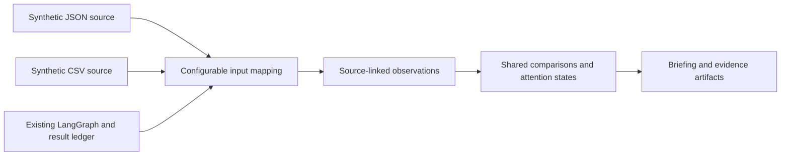
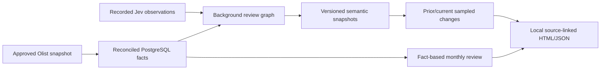

# Current repository map

Maintained integration checkout: `/Users/hudson/Documents/GitHub/BackIntel`.

| Surface | Source | Responsibility |
| --- | --- | --- |
| Product contract | [Roadmap](../roadmap/v0.1.0-development-roadmap.md) and [capability reference](../roadmap/capability-reference.md) | Current issue-review demo steps; full 16-capability acceptance contract and historical plans in the reference |
| Capability simulation | [simulation.py](../../runtime/simulation.py), [CLI](../../scripts/simulate.py), [scenarios](../../config/simulation) | Mapped JSON/CSV inputs, simulated extraction/events, comparisons, attention lifecycle, source-linked artifacts |
| Generic runtime integration | [simulation_graph.py](../../runtime/simulation_graph.py) | Same simulator through existing LangGraph and PostgreSQL ledger; source registration pending runtime update |
| Portable evidence | [contracts.py](../../runtime/contracts.py), [evidence.py](../../runtime/evidence.py), [observations.py](../../runtime/observations.py) | Revision admission, immutable lineage, typed development extraction and correction history; real generic Jev integration pending |
| Predictive lifecycle | [prediction.py](../../runtime/prediction.py), [synthetic.py](../../runtime/synthetic.py) | Time-safe features/outcomes, real evaluation calculations, selection/rollback/scoring; real CatBoost/TabICLv2 structured-only paths checked; real semantic comparison pending |
| Real model boundary | [real_semantics.py](../../runtime/real_semantics.py), [real_models.py](../../runtime/real_models.py), [pinned models](../../config/real_models.json), [probe](../../scripts/real_model_probe.py) | Approved local model execution; separate paid approval, durable request ledger, no uncertain retry; actual Jev probe pending; CPU container execution and model-file recovery checked |
| Real staged execution | [real_pipeline.py](../../runtime/real_pipeline.py), [stage command](../../scripts/real_capabilities.py), [model recovery](../../scripts/validation/check_real_model_restore.py) | Committed history/future plans, one durable start, real predictor updates and replay checked with fixture Jev; combined driver implemented; single actual Jev probe passed, full paid journey pending |
| Restricted generated code | [sandbox.py](../../runtime/sandbox.py), [direct check](../../scripts/validation/check_sandbox.py) | Actual Docker isolation and rejection evidence; host-only execution, bounded logs, constrained generated layouts, audience-scoped preview and retained local reviews; included in the development package; explicit real and predictor-fixture packaging; fixture path checked |
| Audience artifacts and access | [artifacts.py](../../runtime/artifacts.py), [audience_server.py](../../runtime/audience_server.py), [generated_artifacts.py](../../runtime/generated_artifacts.py), [local viewer](../../scripts/audience_demo.py) | Token-bound task/audience access; briefings, analysis, exports, source/history, corrections and reviews; actual sandbox-generated layouts; checked on fixtures |
| Background capabilities | [capability_pipeline.py](../../runtime/capability_pipeline.py), [capability_graph.py](../../runtime/capability_graph.py), [jobs.py](../../runtime/jobs.py), [attention.py](../../runtime/attention.py), [development command](../../scripts/capability_demo.py) | Durable jobs/triggers and local attention; Aegra native cron owns timers; both updated development scenarios verified on isolated localhost:2027; persisted forecast analysis drives attention; real model integrations remain unfinished |
| Development packaging and recovery | [development command](../../scripts/capability_demo.py), [package writer](../../scripts/package_capabilities.py), [restore check](../../scripts/validation/check_capability_restore.py), [compose](../../compose.capabilities.yml) | Direct canonical-image build; pending-work restart, API replay, scoped reports and sandbox review; isolated database restore and cleanup; combined database/model recovery verified on real predictors with fixture Jev; actual Jev recovery pending |
| Real demonstration command | [driver](../../scripts/real_demo.py), [runtime check](../../scripts/validation/check_real_driver_runtime.py), [driver checks](../../tests/test_real_driver.py) | Both scenario scopes checked before credential access; owned expiring tmpfs credential; bounded task-scoped native scheduler; unpaid preparation, denial and restart verified; paid execution pending |
| Real report packaging | [writer](../../scripts/package_capabilities.py), [package check](../../scripts/validation/check_real_package.py), [browser check](../../scripts/validation/check_real_package_browser.cjs) | Explicit development, real and predictor-fixture modes; fixture charges separate from actual billing; scoped offline and sandbox-generated reports checked at desktop/mobile widths |
| Local entrypoint | [poc.py](../../scripts/poc.py) | Database setup, recorded-batch admission, receipt inspection |
| Source facts | [load_olist_facts.py](../../scripts/data/load_olist_facts.py), [migrations](../../migrations) | Fingerprints, row lineage, reconciled relational facts |
| Background execution | [review_graph.py](../../runtime/review_graph.py), [aegra.json](../../aegra.json) | Accepted review batch → signals → comparison → report |
| Model observations | [jev.py](../../runtime/jev.py) | Typed questions, observation provenance, explicit no-inference replay |
| Attribution and changes | [signals.py](../../runtime/signals.py) | Known single-seller/category grouping, immutable versioned snapshots |
| Result and usage ledger | [ledger.py](../../runtime/ledger.py), [costs.py](../../runtime/costs.py) | Conflict detection, accepted results, measured versus unknown charges |
| Review publication | [report.py](../../runtime/report.py), [seller_review.py](../../scripts/data/seller_review.py) | Fact-based review plus sampled semantic changes, source trace, durable HTML/JSON |
| Independent fact checks | [check_seller_review.py](../../scripts/data/check_seller_review.py) | Recompute selected metrics and source links from original CSVs |
| Runtime fixture | [graph.py](../../runtime/graph.py) | Synthetic delay/partition probe for bounded recovery tests; not Olist processing |
| Validation | [manifest](../../tabellio.validation.json), [tests](../../tests) | Exact-commit offline contracts plus separately recorded product evidence |

Two source shapes exercise the same capability code. Rule extraction, virtual triggers, projection, injected failures, and inbox delivery are simulated. Runtime integration uses the existing application ledger; it does not create another execution engine. The installed Olist runtime remains unchanged until a separate update.

## Preserved Olist integration example

The graph also supports separately authorized live enrichment; the PoC entrypoint exposes recorded replay only. Observation provenance always retains the original model and request IDs.

The stale generated Graphify research indexes were deleted during cleanup. Use the source links above for the maintained implementation map; regenerate a scoped graph when a future relationship question requires it.

All eight historical backend worktrees and their obsolete local branch references were removed after successful runtime transition and lifecycle checks. Every implementation commit remains reachable from `main` and the verified recovery bundle. The runtime, PostgreSQL, and Redis containers now reference this canonical checkout; their original data volumes remain in use. See the [recovery plan](../roadmap/poc-recovery-plan.md) for receipts and remaining acceptance limits.

## Report presentation contract

Keep the existing report's system font, navy text, neutral tables, semantic HTML, source links, and explicit caveats. Add one sampled-change section using those same primitives; no new frontend stack or new brand direction. Required rendered states: populated integrated report on 1440px desktop and 390px mobile, keyboard-open source evidence, safe long source IDs, and horizontally scrollable tables without page overflow. No screenshot baseline is promoted automatically.

The audience surface uses the existing report presentation contract as its reference lock: system font, navy text, neutral tables, native forms and details, no external media or new frontend framework. Required states are scoped/empty/denied reports, saved corrections, and accepted/rejected generated candidates at 1440px and 390px. Tables scroll locally with keyboard access; source identifiers wrap. Review evidence is under `artifacts/validation/AudienceUI/8b06b63f-612c-4f36-87f0-ea92c8652785`. This is a working-tree check, not a promoted baseline or final release.
