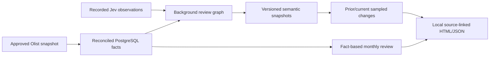

# Current repository map

Maintained integration checkout: `/Users/hudson/Documents/GitHub/BackIntel`.

| Surface | Source | Responsibility |
| --- | --- | --- |
| Product contract | [Roadmap](../roadmap/v0.1.0-development-roadmap.md) | User, Olist boundaries, required outcomes and deferred release work |
| Local entrypoint | [poc.py](../../scripts/poc.py) | Database setup, recorded-batch admission, receipt inspection |
| Source facts | [load_olist_facts.py](../../scripts/data/load_olist_facts.py), [migrations](../../migrations) | Fingerprints, row lineage, reconciled relational facts |
| Background execution | [review_graph.py](../../runtime/review_graph.py), [aegra.json](../../aegra.json) | Accepted review batch → signals → comparison → report |
| Model observations | [jev.py](../../runtime/jev.py) | Typed questions, observation provenance, explicit no-inference replay |
| Attribution and changes | [signals.py](../../runtime/signals.py) | Known single-seller/category grouping, immutable versioned snapshots |
| Result and usage ledger | [ledger.py](../../runtime/ledger.py), [costs.py](../../runtime/costs.py) | Conflict detection, accepted results, measured versus unknown charges |
| Review publication | [report.py](../../runtime/report.py), [seller_review.py](../../scripts/data/seller_review.py) | Fact-based review plus sampled semantic changes, source trace, durable HTML/JSON |
| Independent fact checks | [check_seller_review.py](../../scripts/data/check_seller_review.py) | Recompute selected metrics and source links from original CSVs |
| Runtime fixture | [graph.py](../../runtime/graph.py) | Synthetic delay/partition probe for bounded recovery tests; not Olist processing |
| Validation | [manifest](../../tabellio.validation.json), [tests](../../tests) | Exact-commit offline contracts plus separately recorded product evidence |

The graph also supports separately authorized live enrichment; the PoC entrypoint exposes recorded replay only. Observation provenance always retains the original model and request IDs.

`graphify-out` remains an ignored historical research graph from the initial commit. Its conceptual relationships do not describe this runtime. Use the source links above for the maintained implementation map.

Historical worktrees are preserved references, not independent services or new development homes. `BackIntelSemanticEvidence` still owns the running original demonstration stack. Folder retirement and runtime transition require their separate lifecycle checks; see the recovery plan.

## Report presentation contract

Keep the existing report's system font, navy text, neutral tables, semantic HTML, source links, and explicit caveats. Add one sampled-change section using those same primitives; no new frontend stack or new brand direction. Required rendered states: populated integrated report on 1440px desktop and 390px mobile, keyboard-open source evidence, safe long source IDs, and horizontally scrollable tables without page overflow. No screenshot baseline is promoted automatically.
