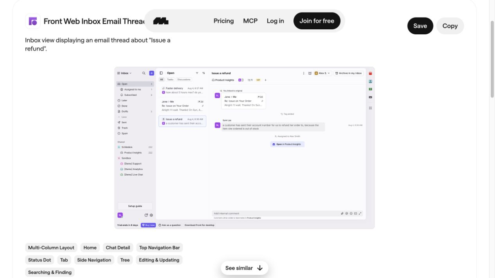

# Decision workspace concept

## Purpose

Help a reviewer decide whether a BackIntel finding needs action, inspect its source, and record a reasoned decision. The working local React and Reflex demos show public-issue review and clearly simulated equipment cases. They share one API and durable review store. This is a frontend demonstration, not proof of prediction quality.

**Design status — 2026-09-29:** the user approved matching Front styling with BackIntel content. The first SVG mockup was rejected and is retained only as an earlier draft. The approved direction uses the inspected Front inbox reference below. The running demos and checks are documented in [frontend/README.md](../../frontend/README.md).

## Revised visual direction

Primary reference: [Front's inbox email thread on Mobbin](https://mobbin.com/explore/screens/3e29dd35-0c1d-4f71-831b-af35c13bf1ec). Borrow its compact navigation, scannable queue, restrained selection state, and focused reading pane. Adapt its composer region into a human decision form. Open source implementation reference: [shadcn sidebar-07](https://ui.shadcn.com/view/new-york-v4/sidebar-07), inspected in a browser.

Use a neutral canvas, thin dividers, compact 32–36px controls, readable body text, and one accent for selection and primary action. Evidence opens on demand in a drawer or tab so the finding has room to read. Keep source facts, interpretation, and predictions visibly distinct through labels and grouping. Avoid oversized cards, decorative shadows, a permanently expanded third evidence column, large summary banners, and a contrasting navy navigation panel. The [reference lock](decision-workspace-reference-lock.json) records the approved direction. The user has not approved a new rendered regression baseline.

## What determines the view

The workflow defines the reader, decision, timing, and actions. A fixed layout then composes reusable sections: queue, case, observed facts, interpretation, optional prediction, evidence, decision, and later outcome. The agent supplies findings within bounded fields; it does not generate executable frontend code or choose arbitrary controls at runtime. A new workflow can omit or rearrange sections through reviewed configuration.

## Proposed data flow

1. The existing Python workflow collects source records, produces facts and findings, and keeps evidence references.
2. A versioned, audience-filtered decision record supplies the frontend. It keeps facts, interpretations, predictions, human decisions, and outcomes separate.
3. The frontend renders the appropriate view and sends human decisions to the server for durable storage. Browser storage is not the system of record.
4. The same record can feed a case view, alert, or summary. Prediction displays carry their evaluation status; experimental predictions do not set queue priority.

The current audience server already has artifact JSON and review routes, but the public-issue prototype is separate. Connecting these requires an issue adapter and a reviewed decision-record contract; the mockup does not imply that integration exists.

## Frontend options for the demo

| Option | Fit | Added work |
| --- | --- | --- |
| Vite + React | Recommended for an interactive, client-rendered review demo backed by Python. Reusable components can render multiple workflows. | Define the shared record, adapter, API, and durable review write. |
| Next.js | Useful if the product later needs server-rendered pages, built-in server routes, or a larger web application. | Adds a second server layer that this local review demo does not yet need. |
| Reflex | Python-first alternative for a compact interactive demonstration. Can use the same record and decision rules. | Build and test a separate UI implementation and its state integration; do not fork the data contract. |

**Decision proposed:** build the main demo with Vite + React + TypeScript, Tailwind CSS 4, and shadcn-compatible Radix primitives. Provide the requested small Reflex comparison using the same decision record. Reflex uses its own Python components and Radix Themes styling; matching the design means sharing token values and behavior, not assuming React component files can be imported unchanged.

## Local infrastructure checked

- `IntelIP/IntelIPWebsite/package.json` declares React 19, Tailwind 4, Radix controls, Instrument Sans, and Phosphor icons. Its actual `src/components/ui/` contains button, badge, card, tabs, separator, toggle, and toggle-group primitives. Inspect and adapt those before adding equivalents.
- Its `components.json` configures an `@intelip` registry at `http://localhost:3000/r/{name}.json`. A read-only connection check found no server listening on that port. Registry configuration is not proof of an operational shared component service.
- The IntelIP design skill and website instructions refer to design-system paths that are absent from the inspected locations. Treat those path references as stale; use present component source and CSS as evidence.
- BackIntel now has a pinned React frontend package and the separate pinned Reflex comparison. Their shared API adapts retained issue evidence; it is separate from the platform's existing audience server.

## Proposed CSS and component stack

| Layer | Choice | Purpose |
| --- | --- | --- |
| Interactive views | React + TypeScript, built with Vite | Queue, case reader, source drawer, and saved review state. |
| Styling | Tailwind CSS 4 + semantic CSS variables | One consistent system for spacing, colors, typography, and responsive layout. Tailwind supplies utilities; the reference and tokens determine the appearance. |
| Controls | Existing shadcn-compatible primitives, backed by Radix | Reuse buttons, tabs, menus, dialogs, and keyboard/focus behavior. Use only the needed components. |
| Typography and icons | Instrument Sans + Phosphor | Match verified local package conventions with one font and icon family. |
| Data boundary | Audience-filtered Python API | Shared decision records and server-side review persistence. The browser never decides evidence access. |
| Python alternative | Reflex + Radix Themes + shared token values | Demonstrate the same review task with Python-authored views. |

Official setup and alternative styling references: [shadcn Vite](https://ui.shadcn.com/docs/installation/vite), [Tailwind 4 support](https://ui.shadcn.com/docs/tailwind-v4), [Reflex styling](https://reflex.dev/docs/styling/overview), and [Reflex theming](https://reflex.dev/docs/styling/theming).

Next.js remains an option if a server-rendered web application becomes a requirement. It does not determine the visual design. The next visual artifact should be a rendered component prototype showing the queue, selected case, evidence drawer, and decision form, before connecting live model execution.

## First direct check

Using one public issue, a reviewer can identify the source facts, distinguish interpretation from prediction, open evidence, save a decision with a reason, and later see the outcome. Repeat the display with a clearly simulated equipment case to test reuse of the layout, not equipment accuracy or operational readiness.
